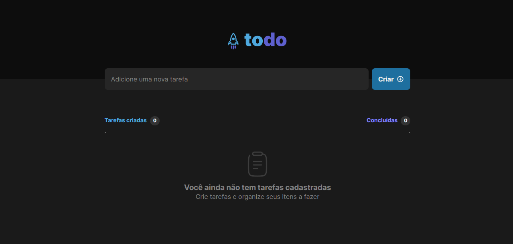

<h1 align="center"> Desafio 01 To-do List com React e Typescript </h1>

* Desafio proposto pela Rocketseat com o intuito de praticarmos todos os conceitos que aprendemos no primeiro modulo do Ignite.

Para obter um resultado proximo o que foi pedido no desafio, precisei rever e colocar em pratica os devidos conceitos:

* Imutabilidade
* Hooks
* Elevação de estado
* Css modules
* Validação do formulário
* Comunicação entre componentes
* Tipagens com Typescript

# Como Rodar o projeto
* Clone o projeto para sua maquina e digite em seu terminal no repositório <code>npm install</code> para instalar todas as dependencias.

* Após isso digite em seu terminal <code>npm run dev</code> para rodar o servidor local na porta 3000.

## Link para acessar o projeto na web : https://todo-list-react-gabrielmatoss.vercel.app/
